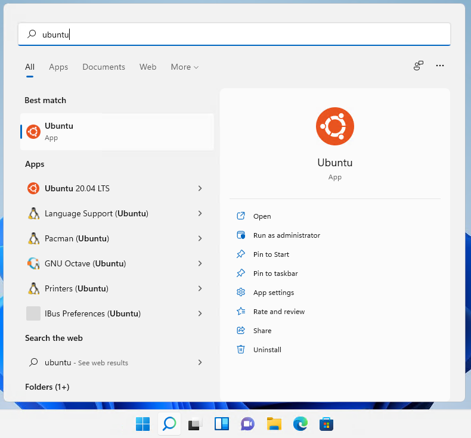
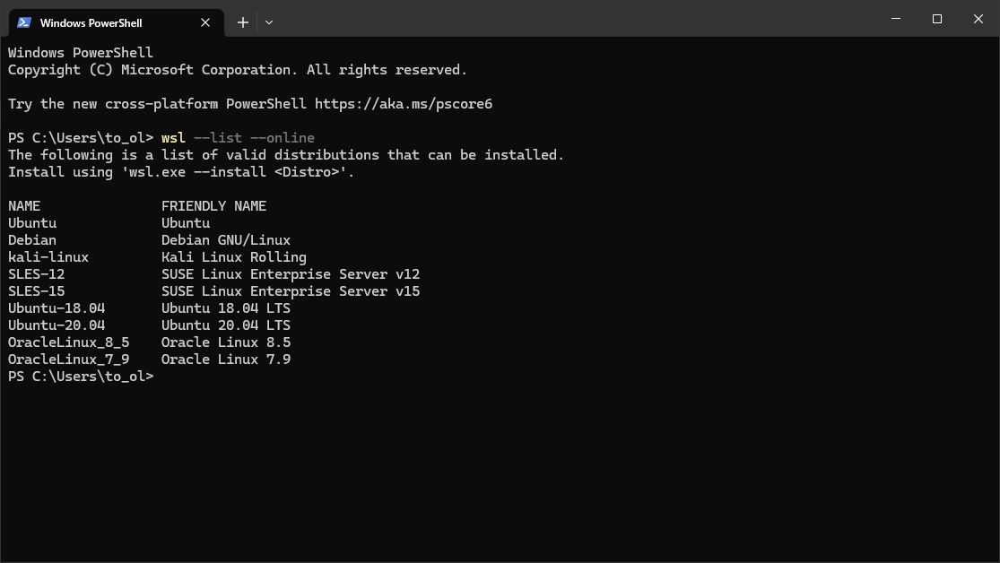
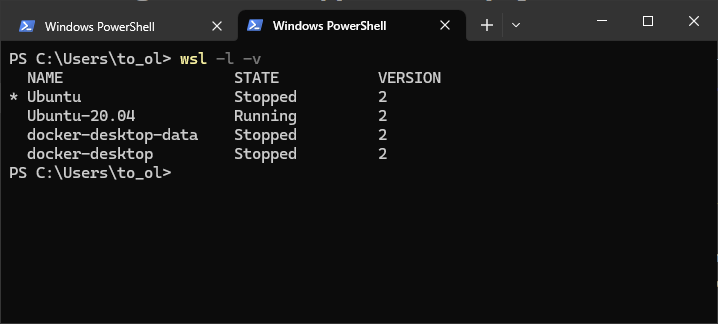
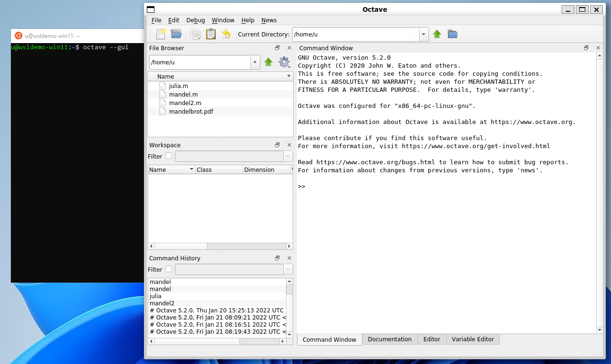
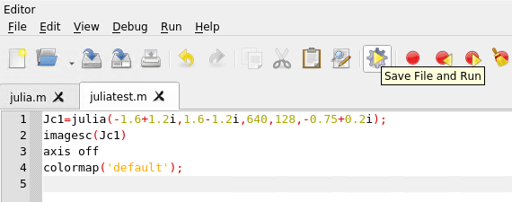
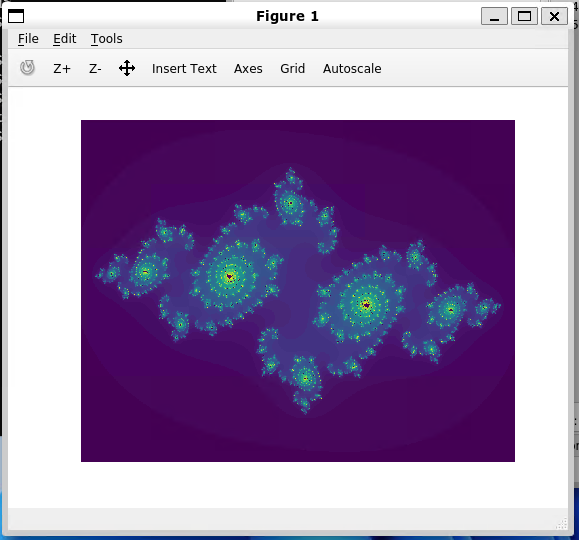

# Install Ubuntu on WSL2 and get started with graphical applications
*Authored by Oliver Smith ([oliver.smith@canonical.com](mailto:oliver.smith@canonical.com))*

## What you will learn:

* How to enable and install WSL on Windows 10 and Windows 11
* How to install and run a simple graphical application that uses WSLg
* How to install and run a much more advanced application that uses WSLg

## What you will need:

* A Windows 10 or Windows 11 physical or virtual machine with all the updates installed

## Install WSL

WSL can be installed from the command line. Open a PowerShell prompt as an Administrator (we recommend using Windows Terminal) and run:
```
wsl --install
```

This command will enable the features necessary to run WSL and also install the default Ubuntu distribution of Linux available in the Microsoft Store. It is recommended to reboot your machine after this initial installation to complete the setup. You can also install WSL from the Microsoft Store.

## Install Ubuntu WSL

WSL supports a variety of Linux distributions including the latest Ubuntu release. Check out [the documentation](../reference/distributions.md) to see which one you prefer. For the rest of this tutorial we'll use `Ubuntu` as the example.

There are multiple ways of installing distros on WSL, here we show three: via the Microsoft store, via Winget, and the WSL CLI. The result is equivalent.

### Method 1: Microsoft store

Find the distribution you prefer on the Microsoft Store and then select `Get`. 


Ubuntu will then be installed on your machine. Once installed, you can either launch the application directly from the store or search for Ubuntu in your Windows search bar.



### Method 2: Winget
Open a PowerShell terminal and type:
```powershell
winget show --name Ubuntu --source msstore
```

You'll see a list of distros available and their ID. Choose the one you prefer and install it. For instance, Ubuntu:
```powershell
winget install --Id 9PDXGNCFSCZV --source msstore
```

<!-- TODO: Run -->

### Method 3: WSL Command line interface

It is possible to install the same Ubuntu applications available on the Windows Store directly from the command line.
In a PowerShell terminal, you can run `wsl --list --online` to see all available distros.

 

You can install a distro using the NAME by running:
```
wsl --install -d Ubuntu-20.04
```

 

Use `wsl -l -v` to see all your currently installed distros and which version of WSL they are using:

 

## Configure Ubuntu

Congratulations, you now have an Ubuntu terminal running on your Windows machine!

Once it has finished its initial setup, you will be prompted to create a username and password. They don't need to match your Windows user credentials.

Finally, it’s always good practice to install the latest updates with the following commands, entering your password when prompted.
```
sudo apt update
sudo apt full-upgrade -y
```

## A basic GUI package: X11 apps

WSL2 comes with WSLg enabled by default. WSLg allows you to run graphical Linux applications. Start with some basic X11 applications:

```
sudo apt update
sudo apt install -y x11-apps
```

To run `xeyes`, a “follow the mouse” application, type:
```
xeyes &
```

The first launch of a GUI application takes a few seconds while WSL is initialising the graphics stack. Next executions of GUI applications are much faster. Leave `xeyes` opened and run the calculator `xcalc` with:
```
xcalc
```

When you move the cursor over the calculator, xeyes follows the cursor. This shows that several GUI applications can interact together.


Note that applications running under WSLg display a little penguin at the bottom right corner of their icons in the Windows taskbar. That's one way you can distinguish applications running on Windows or Ubuntu (besides the window decoration and styling).


Close `xeyes` and `xcalc` by pressing the `X` icon on the top right corner of each X application window. `xcalc` and `xeyes` are very basic X Windows applications but there are plenty of choices in the Linux ecosystem corresponding to your needs and available out of the box on Ubuntu. In the next example, we will use [GNU Octave](https://octave.org/index.html) to perform numerical computation.

## A more advanced example: GNU octave

> ⓘ GNU Octave is software featuring a [high-level programming language](https://en.wikipedia.org/wiki/High-level_programming_language), primarily intended for [numerical computations](https://en.wikipedia.org/wiki/Numerical_analysis). Octave helps in solving linear and nonlinear problems numerically, and for performing other numerical experiments using a language that is mostly compatible with [MATLAB](https://en.wikipedia.org/wiki/MATLAB). [[GNU / Octave](https://octave.org/about.html) ]

We will use it to calculate and draw a beautiful Julia fractal. The goal here is to use Octave to demonstrate how WSLg works, not to go through the theory of fractals. 

First thing is to install the software like we did for x11-apps, from the terminal prompt run:

```
sudo apt update
sudo apt install -y octave
```

Then start the application:
```
octave --gui &
```

Do not forget the ampersand `&` at the end of the line, so the application is started in the background and we can continue using the same terminal window.



In Octave, click on the `New script` icon to open a new editor window and copy/paste the following code:

```octave
#{
Inspired by the work of Bruno Girin ([Geek Thoughts: Fractals with Octave: Classic Mandelbrot and Julia](http://brunogirin.blogspot.com/2008/12/fractals-with-octave-classic-mandelbrot.html))
Calculate a Julia set
zmin: Minimum value of c
zmax: Maximum value of c
hpx: Number of horizontal pixels
niter: Number of iterations
c: A complex number
#}
function M = julia(zmin, zmax, hpx, niter, c)
    %% Number of vertical pixels
    vpx=round(hpx*abs(imag(zmax-zmin)/real(zmax-zmin)));
    %% Prepare the complex plane
    [zRe,zIm]=meshgrid(linspace(real(zmin),real(zmax),hpx),
    linspace(imag(zmin),imag(zmax),vpx));
    z=zRe+i*zIm;
    M=zeros(vpx,hpx);
    %% Generate Julia
    for s=1:niter
        mask=abs(z)<2;
        M(mask)=M(mask)+1;
        z(mask)=z(mask).^2+c;
    end
    M(mask)=0;
end
```

This code is the function that will calculate the Julia set. Save it to a file named `julia.m`. Since it is a function definition, the name of the file must match the name of the function.

Open a second editor window with the New Script button and copy and paste the following code:
```octave
Jc1=julia(-1.6+1.2i, 1.6-1.2i, 640, 128, -0.75+0.2i);
imagesc(Jc1)
axis off
colormap('default');
```

This code calls the function defined in `julia.m`. You can later change the parameters if you want to explore the Julia fractal.

Save it to a file named `juliatest.m`.

And finally, press the button `Save File and Run`.



After a few seconds, depending on your hardware and the parameters, a Julia fractal is displayed.



Like Octave, this window is displayed using WSLg completely transparently to the user.

Enjoy!

## Enjoy Ubuntu on WSL!

That’s it! In this tutorial, we’ve shown you how to install WSL and Ubuntu on Windows 11, set up your profile, install a few packages, and run a graphical application.

We hope you enjoy working with Ubuntu inside WSL. Don’t forget to check out [our blog](https://ubuntu.com/blog) for the latest news on all things Ubuntu.

### Further Reading
* [Setting up WSL for Data Science](https://ubuntu.com/blog/upgrade-data-science-workflows-ubuntu-wsl)
* [Whitepaper: Ubuntu WSL for Data Scientists](https://ubuntu.com/engage/ubuntu-wsl-for-data-scientists)
* [Microsoft WSL Documentation](https://learn.microsoft.com/en-us/windows/wsl/)
* [Ask Ubuntu](https://askubuntu.com/)